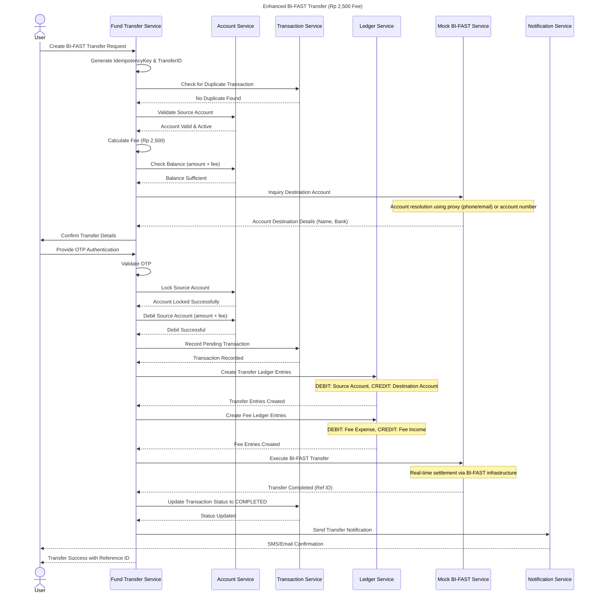

```mermaid
sequenceDiagram
    Title Enhanced BI-FAST Transfer (Rp 2,500 Fee)
    Actor User as User
    participant FTS as Fund Transfer Service
    participant AS as Account Service
    participant TS as Transaction Service
    participant LS as Ledger Service
    participant BFS as Mock BI-FAST Service
    participant NS as Notification Service
    
    User->>FTS: Create BI-FAST Transfer Request
    FTS->>FTS: Generate IdempotencyKey & TransferID
    FTS->>TS: Check for Duplicate Transaction
    TS-->>FTS: No Duplicate Found
    FTS->>AS: Validate Source Account
    AS-->>FTS: Account Valid & Active
    FTS->>FTS: Calculate Fee (Rp 2,500)
    FTS->>AS: Check Balance (amount + fee)
    AS-->>FTS: Balance Sufficient
    FTS->>BFS: Inquiry Destination Account
    Note over BFS: Account resolution using proxy (phone/email) or account number
    BFS-->>FTS: Account Destination Details (Name, Bank)
    FTS->>User: Confirm Transfer Details
    User->>FTS: Provide OTP Authentication
    FTS->>FTS: Validate OTP
    FTS->>AS: Lock Source Account
    AS-->>FTS: Account Locked Successfully
    FTS->>AS: Debit Source Account (amount + fee)
    AS-->>FTS: Debit Successful
    FTS->>TS: Record Pending Transaction
    TS-->>FTS: Transaction Recorded
    FTS->>LS: Create Transfer Ledger Entries
    Note over LS: DEBIT: Source Account, CREDIT: Destination Account
    LS-->>FTS: Transfer Entries Created
    FTS->>LS: Create Fee Ledger Entries
    Note over LS: DEBIT: Fee Expense, CREDIT: Fee Income
    LS-->>FTS: Fee Entries Created
    FTS->>BFS: Execute BI-FAST Transfer
    Note over BFS: Real-time settlement via BI-FAST infrastructure
    BFS-->>FTS: Transfer Completed (Ref ID)
    FTS->>TS: Update Transaction Status to COMPLETED
    TS-->>FTS: Status Updated
    FTS->>NS: Send Transfer Notification
    NS-->>User: SMS/Email Confirmation
    FTS-->>User: Transfer Success with Reference ID

```