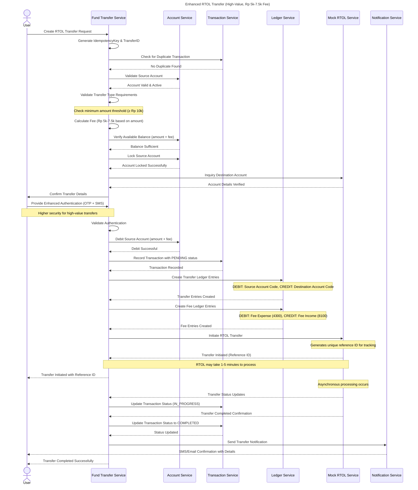

```mermaid
sequenceDiagram
    Title Enhanced RTOL Transfer (High-Value, Rp 5k-7.5k Fee)
    Actor User as User
    participant FTS as Fund Transfer Service
    participant AS as Account Service
    participant TS as Transaction Service
    participant LS as Ledger Service
    participant RTS as Mock RTOL Service
    participant NS as Notification Service
    
    User->>FTS: Create RTOL Transfer Request
    FTS->>FTS: Generate IdempotencyKey & TransferID
    FTS->>TS: Check for Duplicate Transaction
    TS-->>FTS: No Duplicate Found
    FTS->>AS: Validate Source Account
    AS-->>FTS: Account Valid & Active
    FTS->>FTS: Validate Transfer Type Requirements
    Note over FTS: Check minimum amount threshold (≥ Rp 10k)
    FTS->>FTS: Calculate Fee (Rp 5k-7.5k based on amount)
    FTS->>AS: Verify Available Balance (amount + fee)
    AS-->>FTS: Balance Sufficient
    FTS->>AS: Lock Source Account
    AS-->>FTS: Account Locked Successfully
    FTS->>RTS: Inquiry Destination Account
    RTS-->>FTS: Account Details Verified
    FTS->>User: Confirm Transfer Details
    User->>FTS: Provide Enhanced Authentication (OTP + SMS)
    Note over User,FTS: Higher security for high-value transfers
    FTS->>FTS: Validate Authentication
    FTS->>AS: Debit Source Account (amount + fee)
    AS-->>FTS: Debit Successful
    FTS->>TS: Record Transaction with PENDING status
    TS-->>FTS: Transaction Recorded
    FTS->>LS: Create Transfer Ledger Entries
    Note over LS: DEBIT: Source Account Code, CREDIT: Destination Account Code
    LS-->>FTS: Transfer Entries Created
    FTS->>LS: Create Fee Ledger Entries
    Note over LS: DEBIT: Fee Expense (4300), CREDIT: Fee Income (8100)
    LS-->>FTS: Fee Entries Created
    FTS->>RTS: Initiate RTOL Transfer
    Note over RTS: Generates unique reference ID for tracking
    RTS-->>FTS: Transfer Initiated (Reference ID)
    Note over FTS,RTS: RTOL may take 1-5 minutes to process
    FTS-->>User: Transfer Initiated with Reference ID
    
    Note over RTS: Asynchronous processing occurs
    RTS-->>FTS: Transfer Status Updates
    FTS->>TS: Update Transaction Status (IN_PROGRESS)
    
    RTS-->>FTS: Transfer Completed Confirmation
    FTS->>TS: Update Transaction Status to COMPLETED
    TS-->>FTS: Status Updated
    FTS->>NS: Send Transfer Notification
    NS-->>User: SMS/Email Confirmation with Details
    FTS-->>User: Transfer Completed Successfully

```