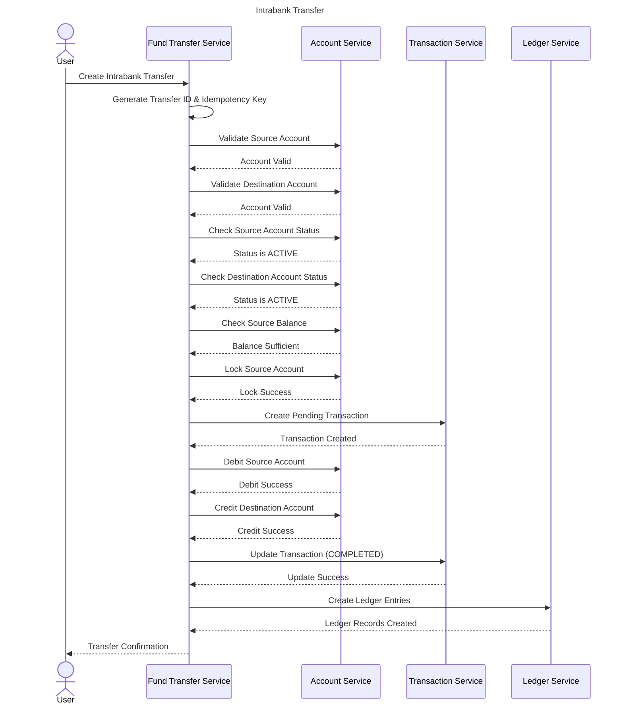

```mermaid
sequenceDiagram
    Title Intrabank Transfer
    Actor User as User
    participant FTS as Fund Transfer Service
    participant AS as Account Service
    participant TS as Transaction Service
    participant LS as Ledger Service
    
    User->>FTS: Create Intrabank Transfer
    FTS->>FTS: Generate Transfer ID & Idempotency Key
    FTS->>AS: Validate Source Account
    AS-->>FTS: Account Valid
    FTS->>AS: Validate Destination Account
    AS-->>FTS: Account Valid
    FTS->>AS: Check Source Account Status
    AS-->>FTS: Status is ACTIVE
    FTS->>AS: Check Destination Account Status
    AS-->>FTS: Status is ACTIVE
    FTS->>AS: Check Source Balance
    AS-->>FTS: Balance Sufficient
    FTS->>AS: Lock Source Account
    AS-->>FTS: Lock Success
    FTS->>TS: Create Pending Transaction
    TS-->>FTS: Transaction Created
    FTS->>AS: Debit Source Account
    AS-->>FTS: Debit Success
    FTS->>AS: Credit Destination Account
    AS-->>FTS: Credit Success
    FTS->>TS: Update Transaction (COMPLETED)
    TS-->>FTS: Update Success
    FTS->>LS: Create Ledger Entries
    LS-->>FTS: Ledger Records Created
    FTS-->>User: Transfer Confirmation


```