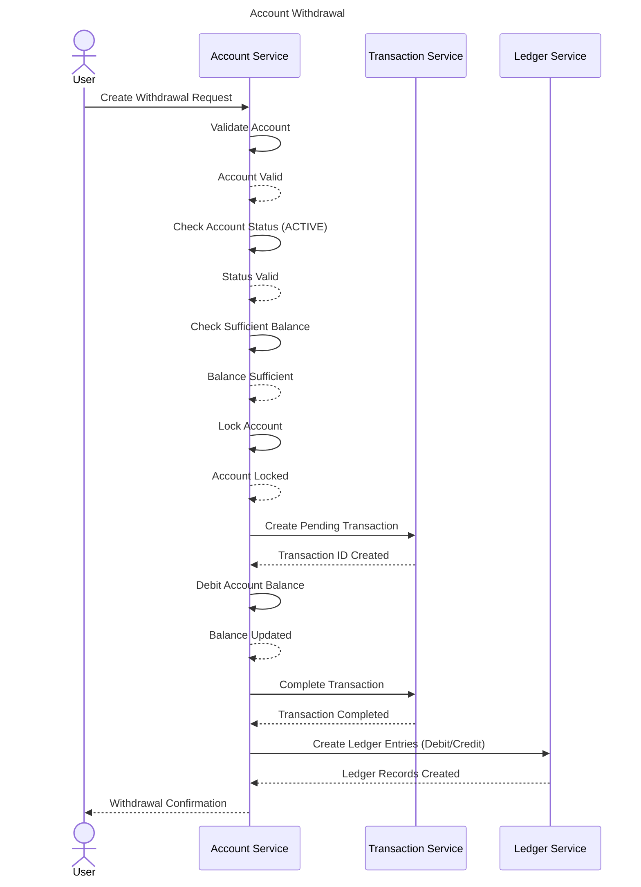

```mermaid
sequenceDiagram
    Title Account Withdrawal
    Actor User as User
    participant AS as Account Service
    participant TS as Transaction Service
    participant LS as Ledger Service
    
    User->>AS: Create Withdrawal Request
    AS->>AS: Validate Account
    AS-->>AS: Account Valid
    AS->>AS: Check Account Status (ACTIVE)
    AS-->>AS: Status Valid
    AS->>AS: Check Sufficient Balance
    AS-->>AS: Balance Sufficient
    AS->>AS: Lock Account
    AS-->>AS: Account Locked
    AS->>TS: Create Pending Transaction
    TS-->>AS: Transaction ID Created
    AS->>AS: Debit Account Balance
    AS-->>AS: Balance Updated
    AS->>TS: Complete Transaction
    TS-->>AS: Transaction Completed
    AS->>LS: Create Ledger Entries (Debit/Credit)
    LS-->>AS: Ledger Records Created
    AS-->>User: Withdrawal Confirmation


```