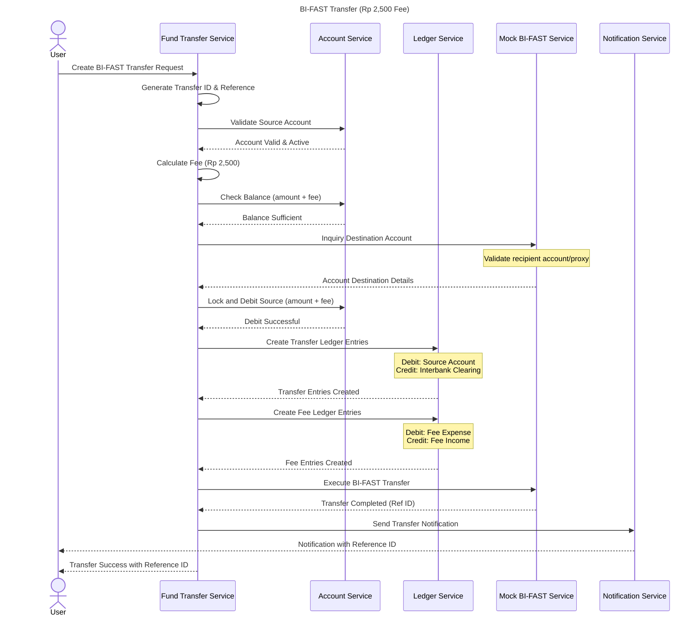

```mermaid
sequenceDiagram
    Title BI-FAST Transfer (Rp 2,500 Fee)
    Actor User as User
    participant FTS as Fund Transfer Service
    participant AS as Account Service
    participant LS as Ledger Service
    participant BFS as Mock BI-FAST Service
    participant NS as Notification Service
    
    User->>FTS: Create BI-FAST Transfer Request
    FTS->>FTS: Generate Transfer ID & Reference
    FTS->>AS: Validate Source Account
    AS-->>FTS: Account Valid & Active
    FTS->>FTS: Calculate Fee (Rp 2,500)
    FTS->>AS: Check Balance (amount + fee)
    AS-->>FTS: Balance Sufficient
    FTS->>BFS: Inquiry Destination Account
    Note over BFS: Validate recipient account/proxy
    BFS-->>FTS: Account Destination Details
    FTS->>AS: Lock and Debit Source (amount + fee)
    AS-->>FTS: Debit Successful
    FTS->>LS: Create Transfer Ledger Entries
    Note over LS: Debit: Source Account<br>Credit: Interbank Clearing
    LS-->>FTS: Transfer Entries Created
    FTS->>LS: Create Fee Ledger Entries
    Note over LS: Debit: Fee Expense<br>Credit: Fee Income
    LS-->>FTS: Fee Entries Created
    FTS->>BFS: Execute BI-FAST Transfer
    BFS-->>FTS: Transfer Completed (Ref ID)
    FTS->>NS: Send Transfer Notification
    NS-->>User: Notification with Reference ID
    FTS-->>User: Transfer Success with Reference ID

```