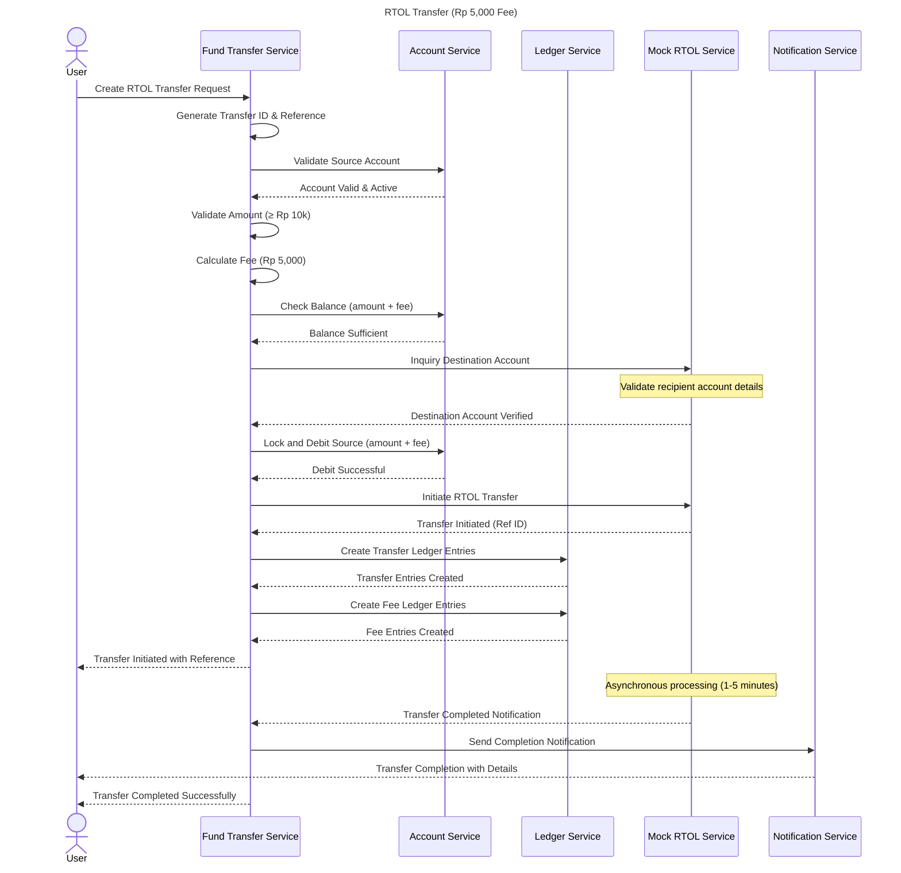

```mermaid
sequenceDiagram
    Title RTOL Transfer (Rp 5,000 Fee)
    Actor User as User
    participant FTS as Fund Transfer Service
    participant AS as Account Service
    participant LS as Ledger Service
    participant RTS as Mock RTOL Service
    participant NS as Notification Service
    
    User->>FTS: Create RTOL Transfer Request
    FTS->>FTS: Generate Transfer ID & Reference
    FTS->>AS: Validate Source Account
    AS-->>FTS: Account Valid & Active
    FTS->>FTS: Validate Amount (≥ Rp 10k)
    FTS->>FTS: Calculate Fee (Rp 5,000)
    FTS->>AS: Check Balance (amount + fee)
    AS-->>FTS: Balance Sufficient
    
    FTS->>RTS: Inquiry Destination Account
    Note over RTS: Validate recipient account details
    RTS-->>FTS: Destination Account Verified
    
    FTS->>AS: Lock and Debit Source (amount + fee)
    AS-->>FTS: Debit Successful
    FTS->>RTS: Initiate RTOL Transfer
    RTS-->>FTS: Transfer Initiated (Ref ID)
    FTS->>LS: Create Transfer Ledger Entries
    LS-->>FTS: Transfer Entries Created
    FTS->>LS: Create Fee Ledger Entries  
    LS-->>FTS: Fee Entries Created
    FTS-->>User: Transfer Initiated with Reference
    
    Note over RTS: Asynchronous processing (1-5 minutes)
    
    RTS-->>FTS: Transfer Completed Notification
    FTS->>NS: Send Completion Notification
    NS-->>User: Transfer Completion with Details
    FTS-->>User: Transfer Completed Successfully

```