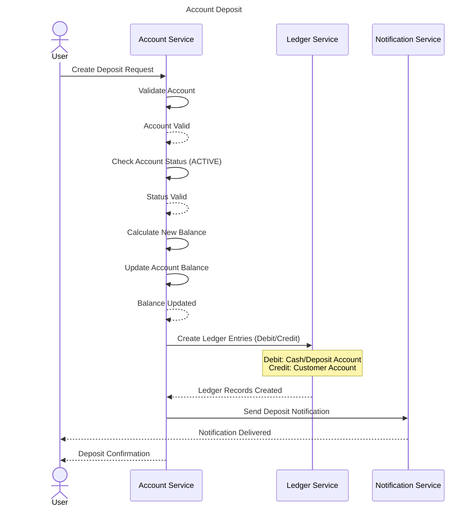

```mermaid
sequenceDiagram
    Title Account Deposit
    Actor User as User
    participant AS as Account Service
    participant LS as Ledger Service
    participant NS as Notification Service
    
    User->>AS: Create Deposit Request
    AS->>AS: Validate Account
    AS-->>AS: Account Valid
    AS->>AS: Check Account Status (ACTIVE)
    AS-->>AS: Status Valid
    AS->>AS: Calculate New Balance
    AS->>AS: Update Account Balance
    AS-->>AS: Balance Updated
    AS->>LS: Create Ledger Entries (Debit/Credit)
    Note over LS: Debit: Cash/Deposit Account<br>Credit: Customer Account
    LS-->>AS: Ledger Records Created
    AS->>NS: Send Deposit Notification
    NS-->>User: Notification Delivered
    AS-->>User: Deposit Confirmation

```