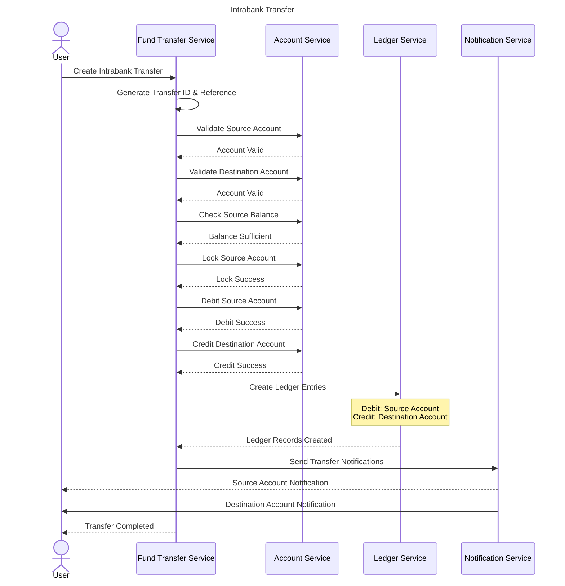

```mermaid
sequenceDiagram
    Title Intrabank Transfer
    Actor User as User
    participant FTS as Fund Transfer Service
    participant AS as Account Service
    participant LS as Ledger Service
    participant NS as Notification Service
    
    User->>FTS: Create Intrabank Transfer
    FTS->>FTS: Generate Transfer ID & Reference
    FTS->>AS: Validate Source Account
    AS-->>FTS: Account Valid
    FTS->>AS: Validate Destination Account
    AS-->>FTS: Account Valid
    FTS->>AS: Check Source Balance
    AS-->>FTS: Balance Sufficient
    FTS->>AS: Lock Source Account
    AS-->>FTS: Lock Success
    FTS->>AS: Debit Source Account
    AS-->>FTS: Debit Success
    FTS->>AS: Credit Destination Account
    AS-->>FTS: Credit Success
    FTS->>LS: Create Ledger Entries
    Note over LS: Debit: Source Account<br>Credit: Destination Account
    LS-->>FTS: Ledger Records Created
    FTS->>NS: Send Transfer Notifications
    NS-->>User: Source Account Notification
    NS->>User: Destination Account Notification
    FTS-->>User: Transfer Completed

```