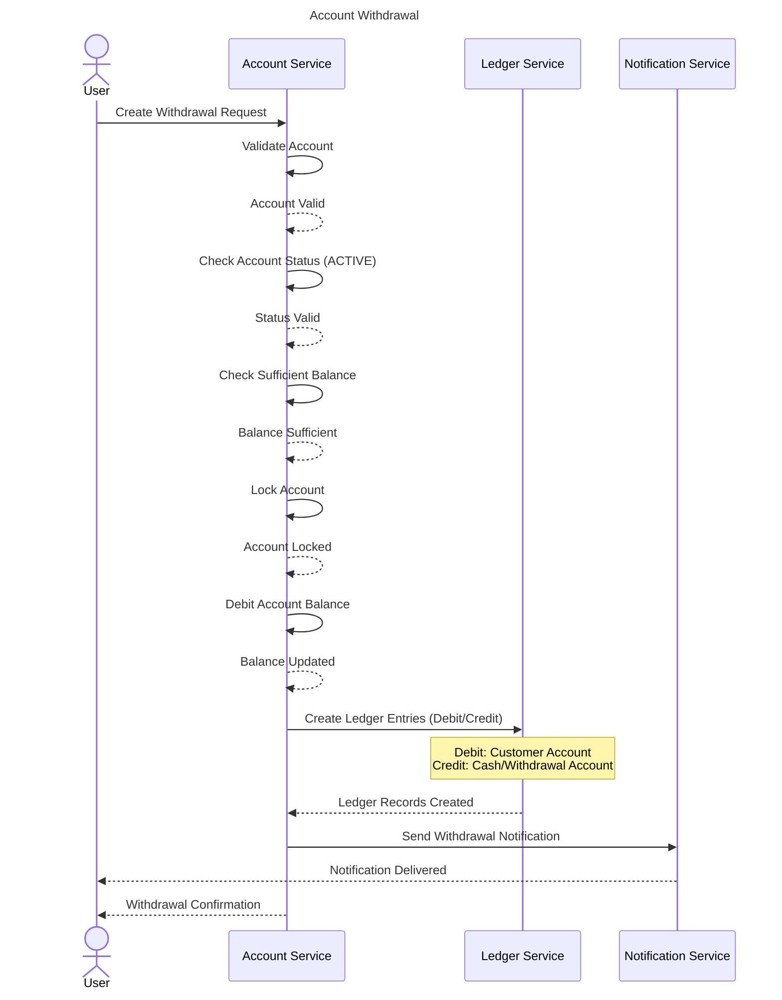

```mermaid
sequenceDiagram
    Title Account Withdrawal
    Actor User as User
    participant AS as Account Service
    participant LS as Ledger Service
    participant NS as Notification Service
    
    User->>AS: Create Withdrawal Request
    AS->>AS: Validate Account
    AS-->>AS: Account Valid
    AS->>AS: Check Account Status (ACTIVE)
    AS-->>AS: Status Valid
    AS->>AS: Check Sufficient Balance
    AS-->>AS: Balance Sufficient
    AS->>AS: Lock Account
    AS-->>AS: Account Locked
    AS->>AS: Debit Account Balance
    AS-->>AS: Balance Updated
    AS->>LS: Create Ledger Entries (Debit/Credit)
    Note over LS: Debit: Customer Account<br>Credit: Cash/Withdrawal Account
    LS-->>AS: Ledger Records Created
    AS->>NS: Send Withdrawal Notification
    NS-->>User: Notification Delivered
    AS-->>User: Withdrawal Confirmation

```