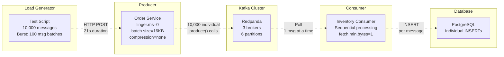

```mermaid

graph LR
    subgraph "Load Generator"
        TC["Test Script<br>10,000 messages<br>Burst: 100 msg batches"]
    end

    subgraph "Producer"
        OS["Order Service<br>linger.ms=0<br>batch.size=16KB<br>compression=none"]
    end

    subgraph "Kafka Cluster"
        K["Redpanda<br>3 brokers<br>6 partitions"]
    end

    subgraph "Consumer"
        IC["Inventory Consumer<br>Sequential processing\nfetch.min.bytes=1"]
    end

    subgraph "Database"
        DB["PostgreSQL<br>Individual INSERTs"]
    end

    %% All arrows (connections) go here, OUTSIDE all subgraphs!
    TC e1@-- HTTP POST<br>21s duration --> OS
    OS e2@-- 10,000 individual<br>produce() calls --> K
    K e3@-- Poll<br>1 msg at a time --> IC
    IC e4@-- INSERT<br>per message --> DB

    classDef animate stroke-dasharray: 9,5,stroke-dashoffset: 900,animation: dash 25s linear infinite;
    class e1,e2,e3,e4 animate;

    
```