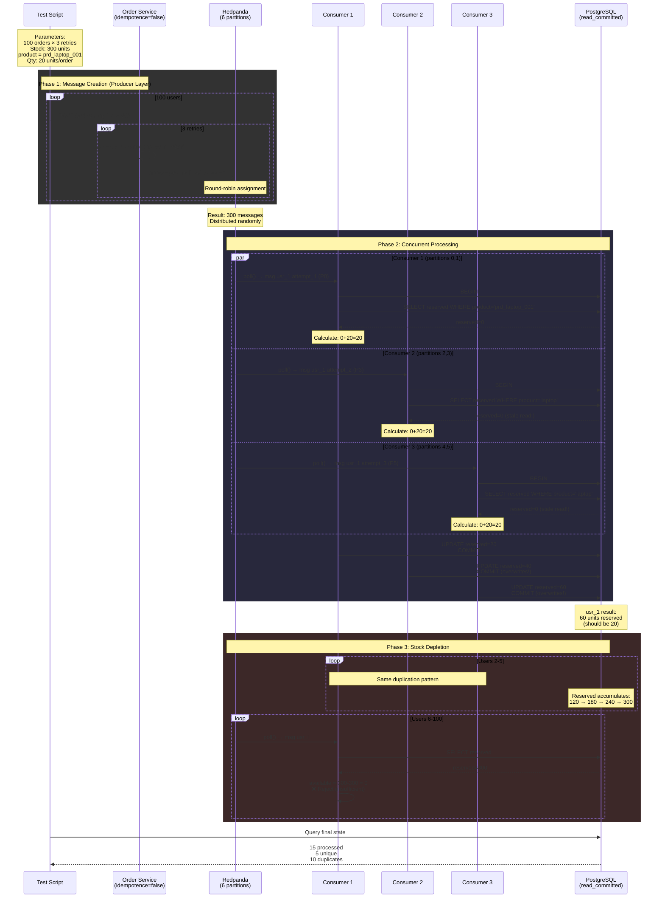

```mermaid

sequenceDiagram
    participant Test as Test Script
    participant API as Order Service<br/>(idempotence=false)
    participant Kafka as Redpanda<br/>(6 partitions)
    participant C1 as Consumer 1
    participant C2 as Consumer 2
    participant C3 as Consumer 3
    participant DB as PostgreSQL<br/>(read_committed)
    Note over Test: Parameters:<br/>100 orders × 3 retries<br/>Stock: 300 units<br/>product = prd_laptop_001<br/>Qty: 20 units/order
    rect rgb(50, 50, 50)
        Note over Test,API: Phase 1: Message Creation (Producer Layer)
        loop 100 users
            Test->>API: POST /orders (usr_i, qty=20)
            loop 3 retries
                API->>API: Generate message (no seq number)
                API->>Kafka: produce(key=null, value=order)
                Note over Kafka: Round-robin assignment
            end
        end
    end
    Note over Kafka: Result: 300 messages<br/>Distributed randomly
    rect rgb(40, 40, 60)
        Note over Kafka,DB: Phase 2: Concurrent Processing
        par Consumer 1 (partitions 0,1)
            Kafka->>C1: poll() → msg usr_1 attempt_1 (P0)
            C1->>DB: BEGIN
            C1->>DB: SELECT reserved WHERE product='prd_laptop_001'
            DB-->>C1: reserved=0
            Note over C1: Calculate: 0+20=20
        and Consumer 2 (partitions 2,3)
            Kafka->>C2: poll() → msg usr_1 attempt_2 (P3)
            C2->>DB: BEGIN
            C2->>DB: SELECT reserved WHERE product='laptop'
            DB-->>C2: reserved=0 (stale read!)
            Note over C2: Calculate: 0+20=20
        and Consumer 3 (partitions 4,5)
            Kafka->>C3: poll() → msg usr_1 attempt_3 (P5)
            C3->>DB: BEGIN
            C3->>DB: SELECT reserved WHERE product='laptop'
            DB-->>C3: reserved=0 (stale read!)
            Note over C3: Calculate: 0+20=20
        end
        C1->>DB: UPDATE reserved=20<br/>COMMIT
        C2->>DB: UPDATE reserved=40<br/>COMMIT (overwrites!)
        C3->>DB: UPDATE reserved=60<br/>COMMIT (overwrites!)
    end
    Note over DB: usr_1 result:<br/>60 units reserved<br/>(should be 20)
    rect rgb(60, 40, 40)
        Note over Kafka,DB: Phase 3: Stock Depletion
        loop Users 2-5
            Note over C1,C3: Same duplication pattern
            Note over DB: Reserved accumulates:<br/>120 → 180 → 240 → 300
        end
        loop Users 6-100
            Kafka->>C1: poll() → msg usr_i
            C1->>DB: SELECT reserved
            DB-->>C1: reserved=300
            C1->>C1: available = 300-300 = 0<br/>❌ Reject (insufficient)
        end
    end
    Test->>DB: Query final state
    DB-->>Test: 15 processed<br/>5 unique<br/>10 duplicates

```